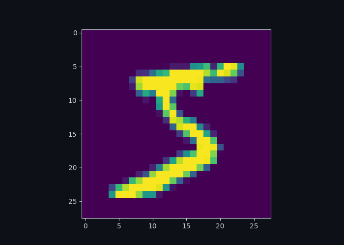
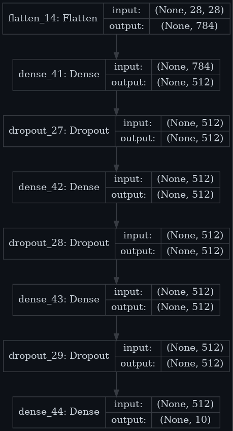

# Основы CNN на примере MNIST
**Задание:** 
Распознайте рукописные цифры  

**Входные данные:** 
- x_train и x_test — тренировочный и тестовый набор изображений в оттенках серого и размером (28,28). Всего тренировочных изображений 60000, а тестовых — 10000
- y_train и y_test — соответствующие метки классов (от 0 до 9)  

**Первая картинка:**
   

**Протестированные модели:** 
- 16 нейронов и 1 слоев
 - 32 нейронов и 1 слоев
 - 128 нейронов и 1 слоев
 - 264 нейронов и 1 слоев
 - 512 нейронов и 1 слоев
 - 16 нейронов и 2 слоев
 - 32 нейронов и 2 слоев
 - 128 нейронов и 2 слоев
 - 264 нейронов и 2 слоев
 - 512 нейронов и 2 слоев
 - 16 нейронов и 3 слоев
 - 32 нейронов и 3 слоев
 - 128 нейронов и 3 слоев
 - 264 нейронов и 3 слоев
 - 512 нейронов и 3 слоев  

**Одна из тестируемых моделей 512-3:**
   
