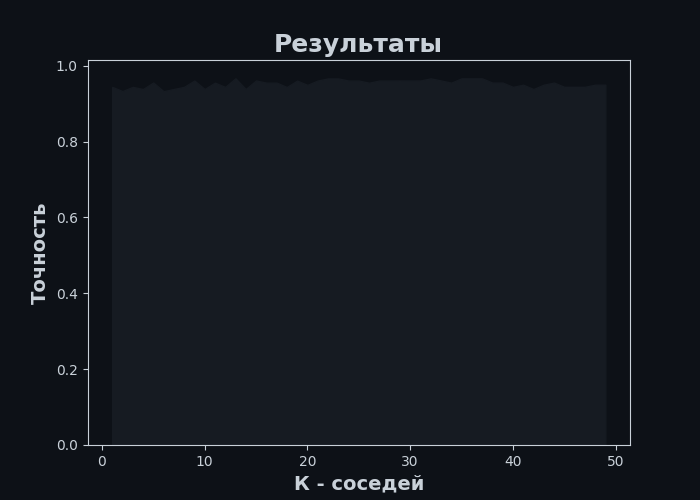

# К ближайших соседей. Подбор параметров.
**Задание:** 
В этом задании нужно проследить за изменением качества алгоритма К ближайших соседей в зависимости от изменений ***К*** и от нормализации данных  
### До нормализации
**Входные данные:**
 <table><tr><th>Индексы</th><th>0</th><th>1</th><th>2</th><th>3</th><th>4</th><th>5</th><th>6</th><th>7</th><th>8</th><th>9</th><th>10</th><th>11</th><th>12</th><th>13</th></tr><tr><th>0</th><th>3.0</th><th>13.45</th><th>3.7</th><th>2.6</th><th>23.0</th><th>111.0</th><th>1.7</th><th>0.92</th><th>0.43</th><th>1.46</th><th>10.68</th><th>0.85</th><th>1.56</th><th>695.0</th></tr><tr><th>1</th><th>3.0</th><th>12.45</th><th>3.03</th><th>2.64</th><th>27.0</th><th>97.0</th><th>1.9</th><th>0.58</th><th>0.63</th><th>1.14</th><th>7.5</th><th>0.67</th><th>1.73</th><th>880.0</th></tr><tr><th>2</th><th>1.0</th><th>13.64</th><th>3.1</th><th>2.56</th><th>15.2</th><th>116.0</th><th>2.7</th><th>3.03</th><th>0.17</th><th>1.66</th><th>5.1</th><th>0.96</th><th>3.36</th><th>845.0</th></tr><tr><th>3</th><th>2.0</th><th>11.82</th><th>1.47</th><th>1.99</th><th>20.8</th><th>86.0</th><th>1.98</th><th>1.6</th><th>0.3</th><th>1.53</th><th>1.95</th><th>0.95</th><th>3.33</th><th>495.0</th></tr><tr><th>4</th><th>3.0</th><th>13.4</th><th>3.91</th><th>2.48</th><th>23.0</th><th>102.0</th><th>1.8</th><th>0.75</th><th>0.43</th><th>1.41</th><th>7.3</th><th>0.7</th><th>1.56</th><th>750.0</th></tr></table>  
**График:**
   
**Ответ:** 
Большая точность при к = 1: 0.7526984126984126  
### После нормализации
**Нормализованные данные:**
 <table><tr><th>Индексы</th><th>0</th><th>1</th><th>2</th><th>3</th><th>4</th><th>5</th><th>6</th><th>7</th><th>8</th><th>9</th><th>10</th><th>11</th><th>12</th><th>13</th></tr><tr><th>0</th><th>3.0</th><th>0.5551058682708996</th><th>1.224099861407362</th><th>0.8534604959063299</th><th>1.052515767916903</th><th>0.7904917675210028</th><th>-0.9535673084830535</th><th>-1.11366982767163</th><th>0.5491077952313275</th><th>-0.22934584401003347</th><th>2.4318695639464587</th><th>-0.4714170802056427</th><th>-1.4854454777140376</th><th>-0.16525375653653862</th></tr><tr><th>1</th><th>3.0</th><th>-0.6801590967524885</th><th>0.62266555385806</th><th>0.9996741323561151</th><th>2.253655737073555</th><th>-0.19249500127257957</th><th>-0.6331009988257639</th><th>-1.4550185132663984</th><th>2.1606690079465167</th><th>-0.7900127656757631</th><th>1.0562970181278508</th><th>-1.2611380490328303</th><th>-1.2453301991049202</th><th>0.423877585105576</th></tr><tr><th>2</th><th>1.0</th><th>0.7898062116253449</th><th>0.6855019740497783</th><th>0.7072468594565445</th><th>-1.289707171938568</th><th>1.141558470661568</th><th>0.6487642398033955</th><th>1.0046999564606098</th><th>-1.5459217812984185</th><th>0.12107098203104735</th><th>0.01812905901946736</th><th>0.01119017852208315</th><th>1.0569515899119117</th><th>0.3124203042543651</th></tr><tr><th>3</th><th>2.0</th><th>-1.458376024717222</th><th>-0.7776889532716569</th><th>-1.3762974599528943</th><th>0.3918887848807448</th><th>-0.9648417481818229</th><th>-0.5049144749628478</th><th>-0.43097245648209276</th><th>-0.4984069930335457</th><th>-0.10669995489565505</th><th>-1.3444663873102856</th><th>-0.03268320863498288</th><th>1.0145783054514796</th><th>-0.8021525042577436</th></tr><tr><th>4</th><th>3.0</th><th>0.4933426200197315</th><th>1.412609121982516</th><th>0.41481958655697393</th><th>1.052515767916903</th><th>0.15857170186798558</th><th>-0.7933341536544085</th><th>-1.2843441704690142</th><th>0.5491077952313275</th><th>-0.3169500505203038</th><th>0.9697830215354855</th><th>-1.1295178875616327</th><th>-1.4854454777140376</th><th>0.009893399086792766</th></tr></table>  
**График:**
   
**Ответ:** 
Большая точность при к = 21: 0.9831746031746033  
**Результат:** 
Большая точность достигается при нормализации данных и при к = 21: 98.32%  