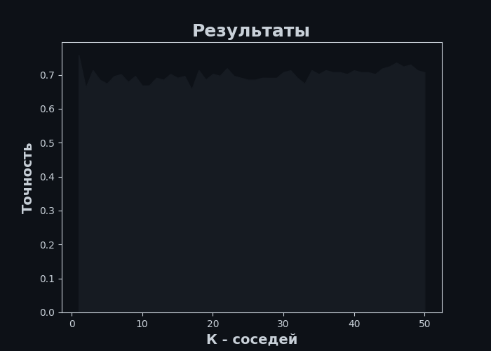

# К ближайших соседей. Подбор параметров.
**Задание:** 
В этом задании нужно проследить за изменением качества алгоритма К ближайших соседей в зависимости от изменений ***К*** и от нормализации данных  
### До нормализации
**Входные данные:**
 <table><tr><th>Индексы</th><th>0.00</th><th>1.00</th><th>2.00</th><th>3.00</th><th>4.00</th><th>5.00</th><th>6.00</th><th>7.00</th><th>8.00</th><th>9.00</th><th>10.00</th><th>11.00</th><th>12.00</th><th>13.00</th></tr><tr><th>0</th><th>2.00</th><th>12.29</th><th>3.17</th><th>2.21</th><th>18.00</th><th>88.00</th><th>2.85</th><th>2.99</th><th>0.45</th><th>2.81</th><th>2.30</th><th>1.42</th><th>2.83</th><th>406.00</th></tr><tr><th>1</th><th>2.00</th><th>12.42</th><th>1.61</th><th>2.19</th><th>22.50</th><th>108.00</th><th>2.00</th><th>2.09</th><th>0.34</th><th>1.61</th><th>2.06</th><th>1.06</th><th>2.96</th><th>345.00</th></tr><tr><th>2</th><th>3.00</th><th>13.32</th><th>3.24</th><th>2.38</th><th>21.50</th><th>92.00</th><th>1.93</th><th>0.76</th><th>0.45</th><th>1.25</th><th>8.42</th><th>0.55</th><th>1.62</th><th>650.00</th></tr><tr><th>3</th><th>1.00</th><th>13.94</th><th>1.73</th><th>2.27</th><th>17.40</th><th>108.00</th><th>2.88</th><th>3.54</th><th>0.32</th><th>2.08</th><th>8.90</th><th>1.12</th><th>3.10</th><th>1260.00</th></tr><tr><th>4</th><th>3.00</th><th>12.93</th><th>2.81</th><th>2.70</th><th>21.00</th><th>96.00</th><th>1.54</th><th>0.50</th><th>0.53</th><th>0.75</th><th>4.60</th><th>0.77</th><th>2.31</th><th>600.00</th></tr></table>  
**График:**
   
**Ответ:** 
Большая точность при к = 1: 0.7584126984126984  
### После нормализации
**Нормализованные данные:**
 <table><tr><th>Индексы</th><th>0.00</th><th>1.00</th><th>2.00</th><th>3.00</th><th>4.00</th><th>5.00</th><th>6.00</th><th>7.00</th><th>8.00</th><th>9.00</th><th>10.00</th><th>11.00</th><th>12.00</th><th>13.00</th></tr><tr><th>0</th><th>2.00</th><th>-0.88</th><th>0.75</th><th>-0.57</th><th>-0.45</th><th>-0.82</th><th>0.89</th><th>0.96</th><th>0.71</th><th>2.14</th><th>-1.19</th><th>2.03</th><th>0.31</th><th>-1.09</th></tr><tr><th>1</th><th>2.00</th><th>-0.72</th><th>-0.65</th><th>-0.65</th><th>0.90</th><th>0.58</th><th>-0.47</th><th>0.06</th><th>-0.18</th><th>0.03</th><th>-1.30</th><th>0.45</th><th>0.49</th><th>-1.28</th></tr><tr><th>2</th><th>3.00</th><th>0.39</th><th>0.81</th><th>0.05</th><th>0.60</th><th>-0.54</th><th>-0.59</th><th>-1.27</th><th>0.71</th><th>-0.60</th><th>1.45</th><th>-1.79</th><th>-1.40</th><th>-0.31</th></tr><tr><th>3</th><th>1.00</th><th>1.16</th><th>-0.54</th><th>-0.35</th><th>-0.63</th><th>0.58</th><th>0.94</th><th>1.52</th><th>-0.34</th><th>0.86</th><th>1.66</th><th>0.71</th><th>0.69</th><th>1.63</th></tr><tr><th>4</th><th>3.00</th><th>-0.09</th><th>0.43</th><th>1.22</th><th>0.45</th><th>-0.26</th><th>-1.21</th><th>-1.54</th><th>1.35</th><th>-1.47</th><th>-0.20</th><th>-0.82</th><th>-0.43</th><th>-0.47</th></tr></table>  
**График:**
   
**Ответ:** 
Большая точность при к = 13: 0.9665079365079364  
**Результат:** 
Большая точность достигается при нормализации данных и при к = 13: 96.65%  