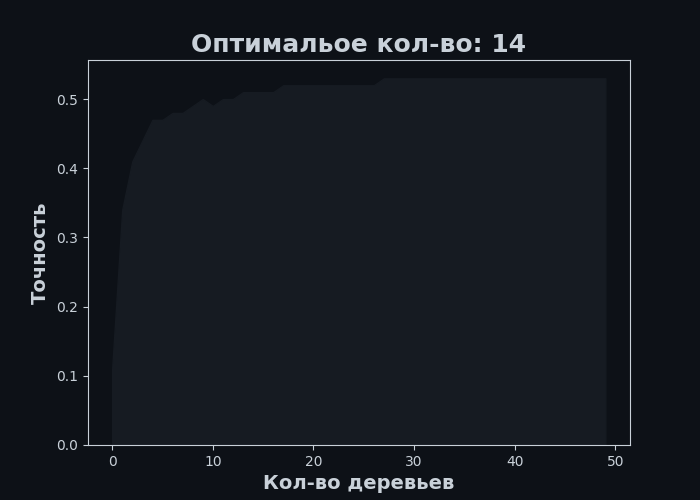

#Изучение зависимости точности в Случайном лесу
**Задание:** 
В этом задании нужно проследить за изменением качества случайного леса в зависимости от количества деревьев в нем.Используется датасет, в котором требуется предсказать возраст ракушки (число колец) по физическим измерениям. Определите, при каком минимальном количестве деревьев случайный лес показывает качество на кросс-валидации выше 0.52  
**Таблица:**
 <table><tr><th>Индексы</th><th>Sex</th><th>Length</th><th>Diameter</th><th>Height</th><th>WholeWeight</th><th>ShuckedWeight</th><th>VisceraWeight</th><th>ShellWeight</th><th>Rings</th></tr><tr><th>0</th><th>1.0</th><th>0.455</th><th>0.365</th><th>0.095</th><th>0.514</th><th>0.2245</th><th>0.101</th><th>0.15</th><th>15.0</th></tr><tr><th>1</th><th>1.0</th><th>0.35</th><th>0.265</th><th>0.09</th><th>0.2255</th><th>0.0995</th><th>0.0485</th><th>0.07</th><th>7.0</th></tr><tr><th>2</th><th>-1.0</th><th>0.53</th><th>0.42</th><th>0.135</th><th>0.677</th><th>0.2565</th><th>0.1415</th><th>0.21</th><th>9.0</th></tr><tr><th>3</th><th>1.0</th><th>0.44</th><th>0.365</th><th>0.125</th><th>0.516</th><th>0.2155</th><th>0.114</th><th>0.155</th><th>10.0</th></tr><tr><th>4</th><th>0.0</th><th>0.33</th><th>0.255</th><th>0.08</th><th>0.205</th><th>0.0895</th><th>0.0395</th><th>0.055</th><th>7.0</th></tr></table>  
**График зависимости:**
   
**Ответ:** 
Минимальное кол-во деревьев, для точности больше 0,52: 14  