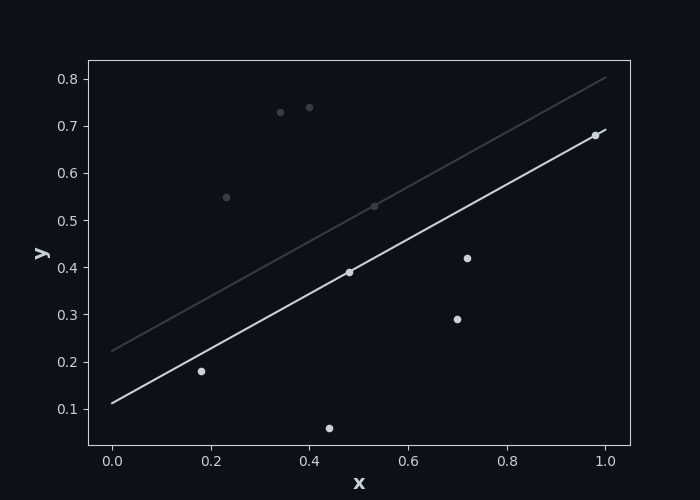

# Метод опорных векторов. Опорные объекты
**Задание:** 
Определите объекты которые разделяют выборку лучше всего.  
**Входные данные:**
 <table><tr><th>Индексы</th><th>Цель</th><th>x</th><th>y</th></tr><tr><th>0</th><th>0.00</th><th>0.70</th><th>0.29</th></tr><tr><th>1</th><th>1.00</th><th>0.23</th><th>0.55</th></tr><tr><th>2</th><th>0.00</th><th>0.72</th><th>0.42</th></tr><tr><th>3</th><th>0.00</th><th>0.98</th><th>0.68</th></tr><tr><th>4</th><th>0.00</th><th>0.48</th><th>0.39</th></tr><tr><th>5</th><th>1.00</th><th>0.34</th><th>0.73</th></tr><tr><th>6</th><th>0.00</th><th>0.44</th><th>0.06</th></tr><tr><th>7</th><th>1.00</th><th>0.40</th><th>0.74</th></tr><tr><th>8</th><th>0.00</th><th>0.18</th><th>0.18</th></tr><tr><th>9</th><th>1.00</th><th>0.53</th><th>0.53</th></tr></table>  
**Разделение:**
   
**Опорные объекты:** 
3 4 9  